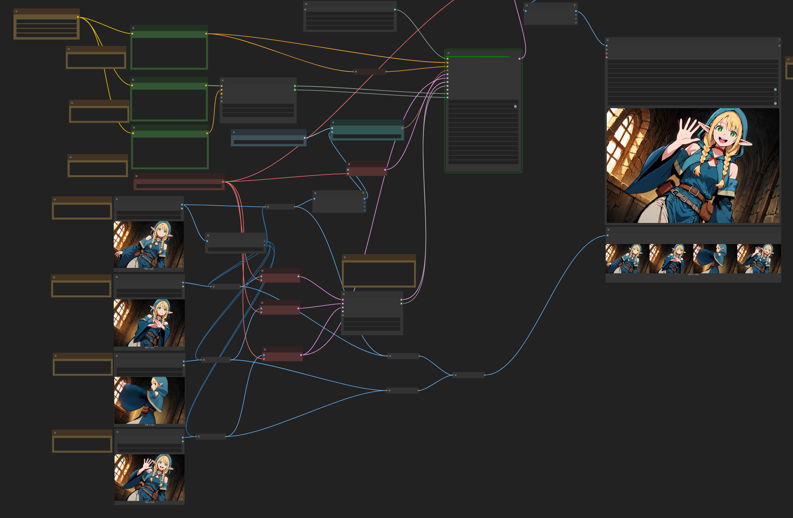

**Notice: This is a fork by nirvash. This repository is a test version for keyframe support, based on original ComfyUI-FramePackWrapper.  
Original repository (kijai): https://github.com/kijai/ComfyUI-FramePackWrapper**

## Start - End test
https://github.com/user-attachments/assets/d4af1e9b-904f-41aa-8a00-4306ed4ff4b0

## Keyframe test
https://github.com/user-attachments/assets/23e777e5-dd49-444f-bccf-69b4d00625a2

https://github.com/user-attachments/assets/dbc4444e-5e6d-41ad-b1ff-801f27ca86cf

## Feature
 - Set end frame
 - Assign weighted keyframes
 - Use different prompts per section

# ComfyUI Wrapper for [FramePack by lllyasviel](https://lllyasviel.github.io/frame_pack_gitpage/)

# WORK IN PROGRESS

Mostly working, took some liberties to make it run faster.

Uses all the native models for text encoders, VAE and sigclip:

https://huggingface.co/Comfy-Org/HunyuanVideo_repackaged/tree/main/split_files

https://huggingface.co/Comfy-Org/sigclip_vision_384/tree/main

And the transformer model itself is either autodownloaded from here:

https://huggingface.co/lllyasviel/FramePackI2V_HY/tree/main

to `ComfyUI\models\diffusers\lllyasviel\FramePackI2V_HY`

Or from single file, in `ComfyUI\models\diffusion_models`:

https://huggingface.co/Kijai/HunyuanVideo_comfy/blob/main/FramePackI2V_HY_fp8_e4m3fn.safetensors
https://huggingface.co/Kijai/HunyuanVideo_comfy/blob/main/FramePackI2V_HY_bf16.safetensors
